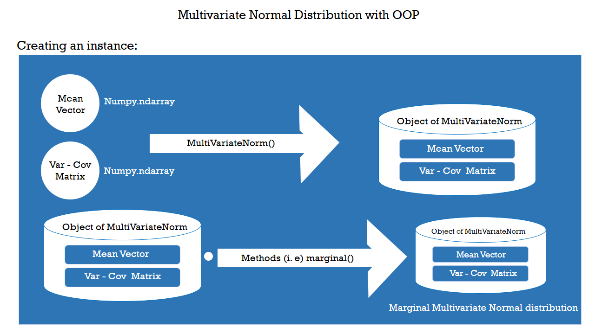
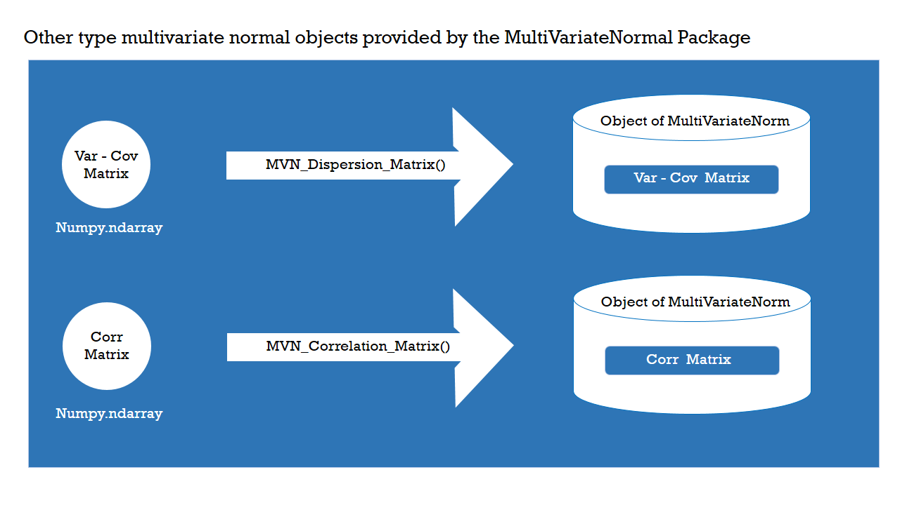
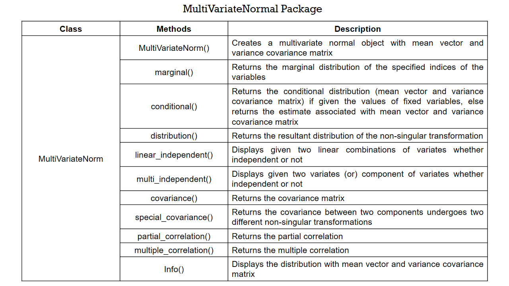
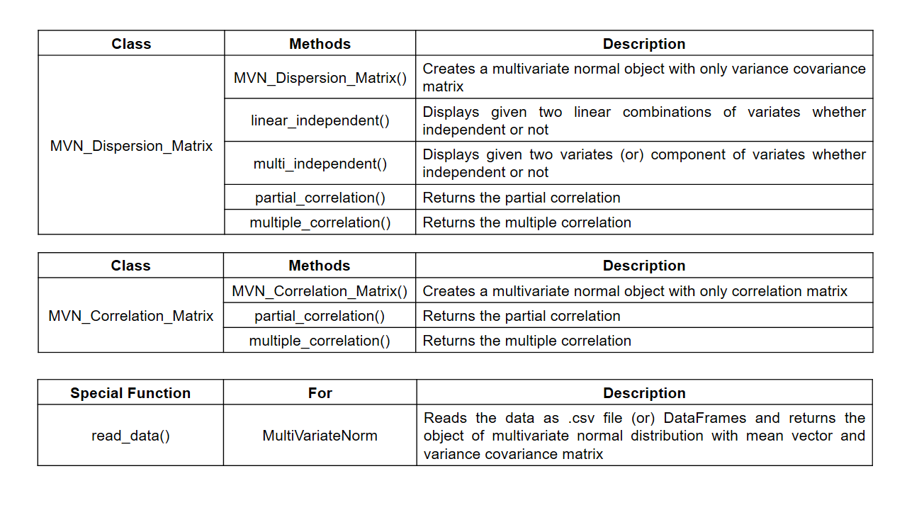
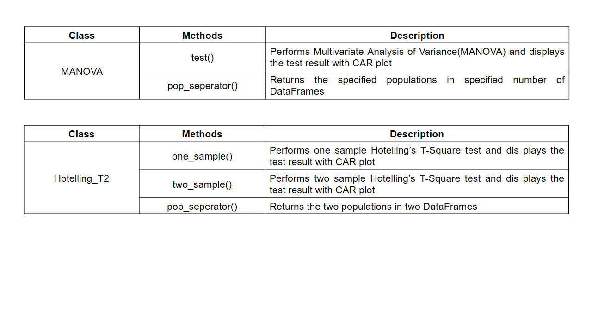

# Object-Oriented-Multivariate-Normal-Distribution-Analysis-in-Python
Multivariate Normal Distribution analysis with OOP concept in Python

# Abstract
The multivariate normal distribution is a statistical concept that extends beyond the typical bell-shaped curve, encompassing scenarios where multiple related random variables are involved. While popular Python packages like Statsmodels, Scipy and Pyro handle multivariate normal problems, they lack specific functions for tasks such as finding conditional and marginal distributions, checking independence, calculating correlation coefficients, handling unequal covariance matrices in two-sample problems, conducting multivariate analysis of variance and comparing population means using Wilk’s lambda. To address these gaps, the proposed MultiVariateNormal package aims to provide explicit functions for these tasks. This will make it easier for users to work with and analyze multivariate normal distributions in a more comprehensive manner.

# Features
Compute 
-----------------------------------------------------------------------
- Marginal distributions
- Condtional distributions
- Resultant distributions and covariance
- Independence of variates
- Partial correlations
- Multiple correlations

Test
------------------------------------------------------------------------
- Hotelling's T Square - One Sample and Two Sample (Mean Vector)
- Multivariate Analysis of Variance - MANOVA

Visualize
------------------------------------------------------------------------
- All test's null distribution curve with Critical and Acceptance Region
  plot (CAR plot) (if Visualable)
  
# Concept of Treating Multivariate Normal Distributions as Objects  

# Software Details
## Dependencies
  1. Python - Programming language - 3.11.4 to 3.11.7
  2. Numpy - 1.25.0 -  (for installation --> pip install numpy)
  3. Pandas - 2.0.2 - (for installation --> pip install pandas )
  4. SciPy - 1.11.1 -(for installation --> pip install scipy)
  5. Matplotlib - 3.7.1 - (for installation --> pip install matplotlib)

## Classes and Methods

#### By using MultiVariateNormal package , Problems in  Anderson, T. W. (2003). *An Introduction to Multivariate Statistical Analysis* (3rd ed.) and Johnson, R. A., & Wichern, D. W. (2002). *Applied Multivariate Statistical Analysis* (5th ed.) has been solved and presented in both Jupyter book source file as well as Python script file.

